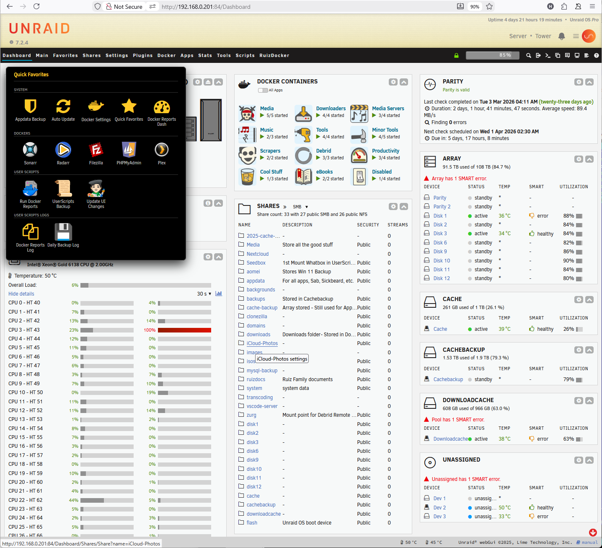
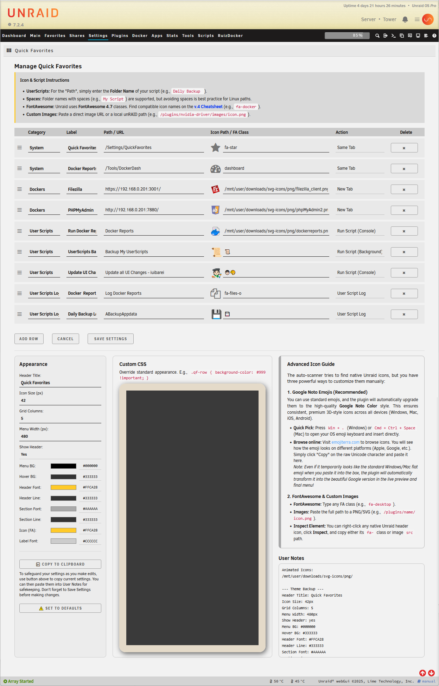
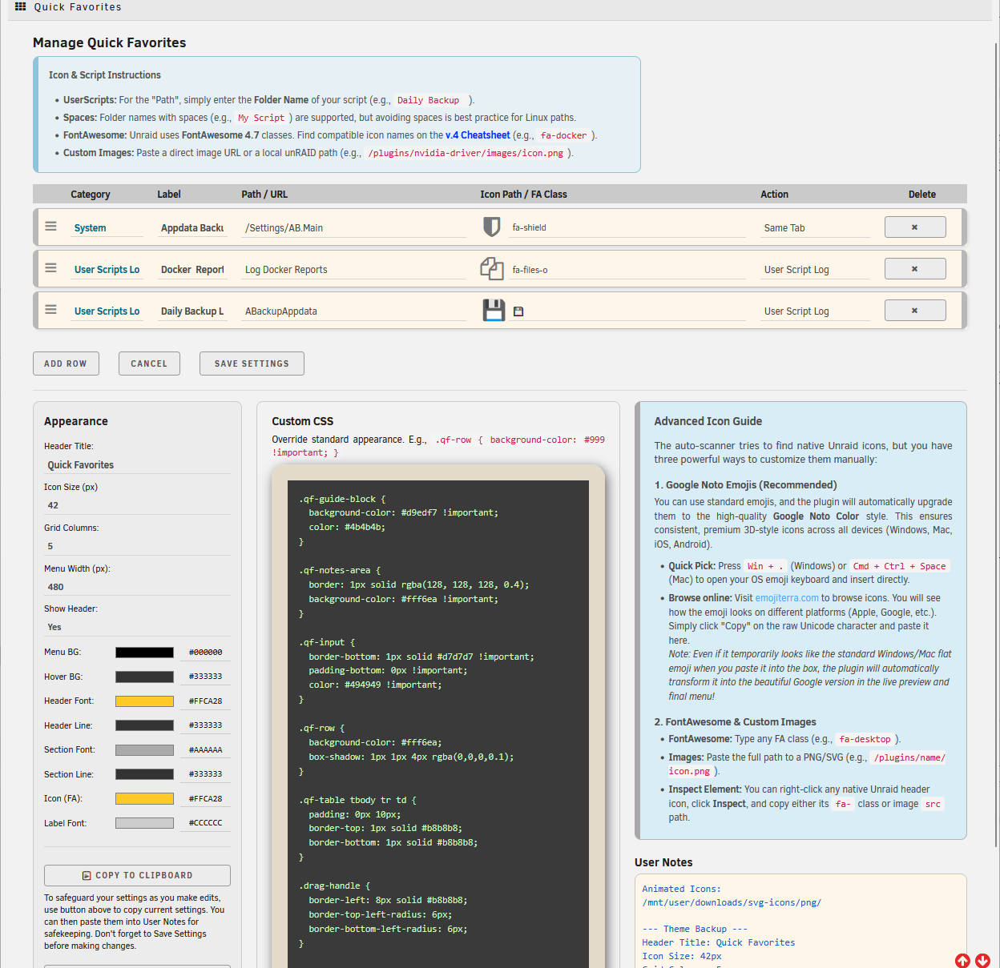

# 🌟 Quick Favorites for Unraid

A custom favorites menu for the unRAIDheader. Easily navigate to pages, Docker containers, and User Scripts with live previews and icon support.

Supercharge your unRAIDnavigation! **Quick Favorites** allows you to build a beautifully customized, lightning-fast pop-up menu right into your unRAIDheader. This takes the existing "Favorites" and replaces it with our Quick Favorites pop-up.

Stop clicking through endless tabs to find your most-used settings, Docker containers, or User Scripts. Put them all in one place, accessible from anywhere in your unRAID WebUI.




---

## ✨ Features
* **Everywhere You Need It:** The menu attaches to the Star icon in the top right of your unRAIDheader, making it accessible from any page.
* **Fully Customizable Look:** Change the width, grid layout, colors, and borders to perfectly match your unRAIDtheme.
* **Icon Support:** Use standard FontAwesome icons, native Emojis, or paste a URL to a custom image!
* **User Scripts Integration:** Don't just navigate—execute! You can map buttons to run your favorite User Scripts directly from the menu.



In addition to being able to define the UI's look, the plugin also supports CSS customization for finer detail control.  


---

## 🚀 The Actions Explained
When adding a new link in the Quick Favorites settings, you have access to powerful "Actions" that change how the link behaves. Here is what they do:

### 🔗 Standard Navigation
* **`Save Tab` (Same Window):** Perfect for navigating to internal unRAIDpages (e.g., `/Dashboard` or `/Settings/DockerSettings`). It opens the link in your current tab.
* **`New Tab` (New Window):** Ideal for external web GUIs (like Sonarr, Plex, or your router's IP). It opens the link in a brand new browser tab.

### 📜 User Scripts Magic
*You must have the "User Scripts" plugin installed to use these features.*
* **`Run Script (Console)` (Run in Console Window):** Click the button, and the traditional UserScripts script console window will pop up showing the script running in real-time.
* **`Run Script (Background)` (Run in Background):** Same as the UserScripts, the script will run silently in the background without interrupting your workflow.
* **`User Script Log` (View you scheduled Logs):** Instantly pops open a clean, formatted window to show the output logs of a specific script.

---

## 🛠️ How to Install

Installing Quick Favorites is incredibly simple. 

1. Log into your unRAID WebGUI.
2. Navigate to the **Plugins** tab.
3. Select the **Install Plugin** tab.
4. Paste the URL below into the text box and click **Install**:

```text
https://raw.githubusercontent.com/hernandito/quick.favorites/main/quick.favorites.plg
